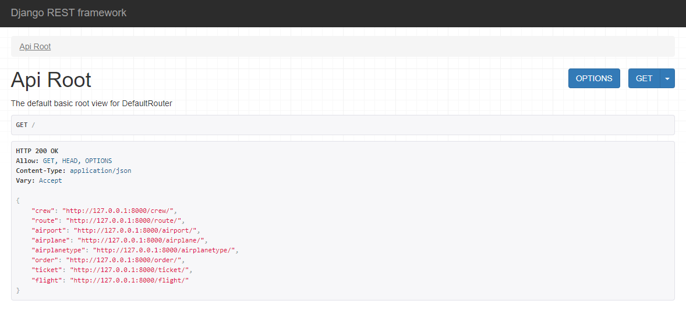
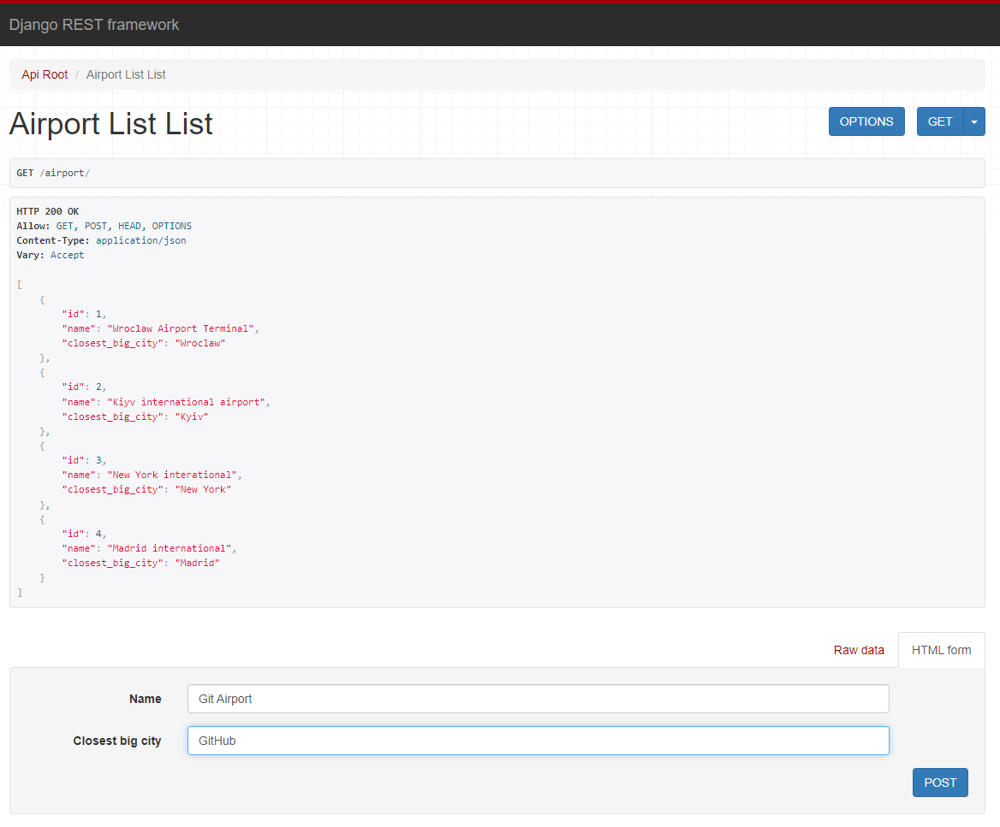
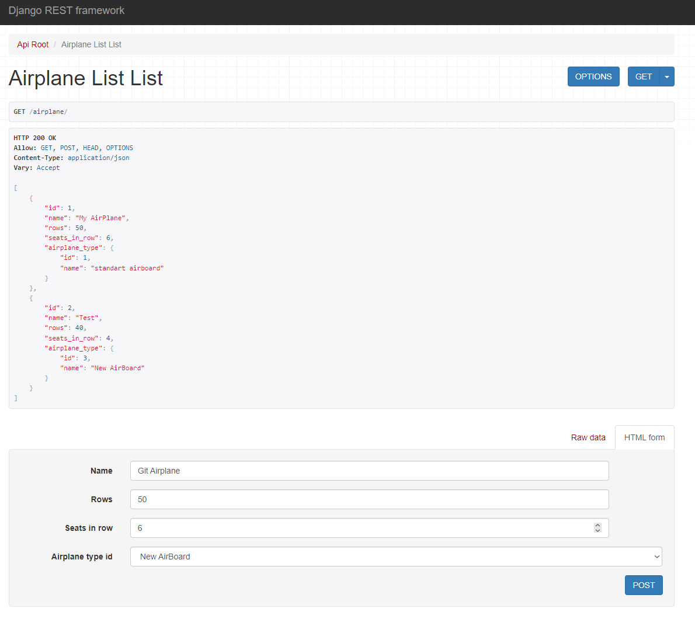
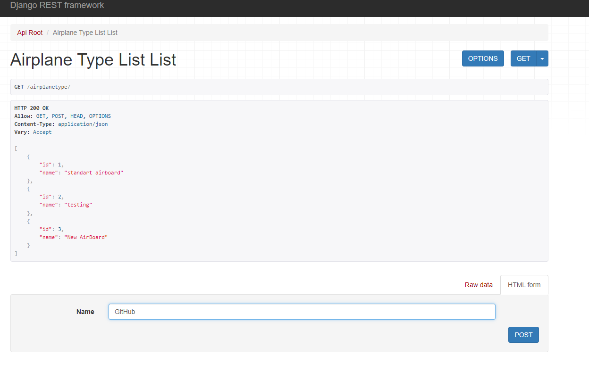
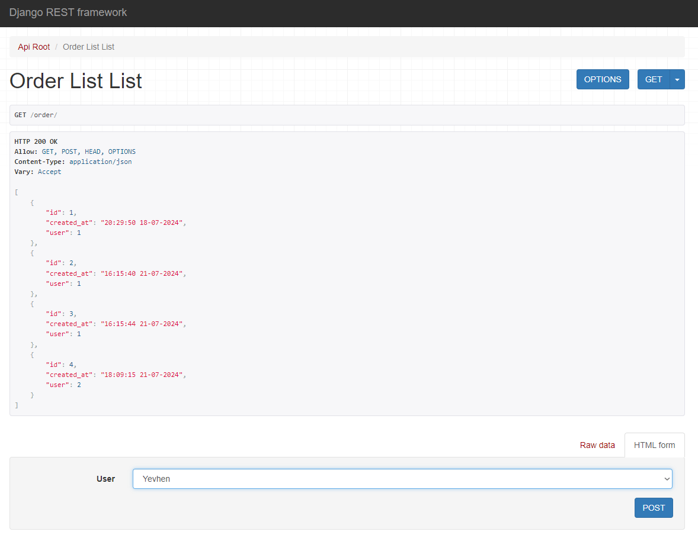
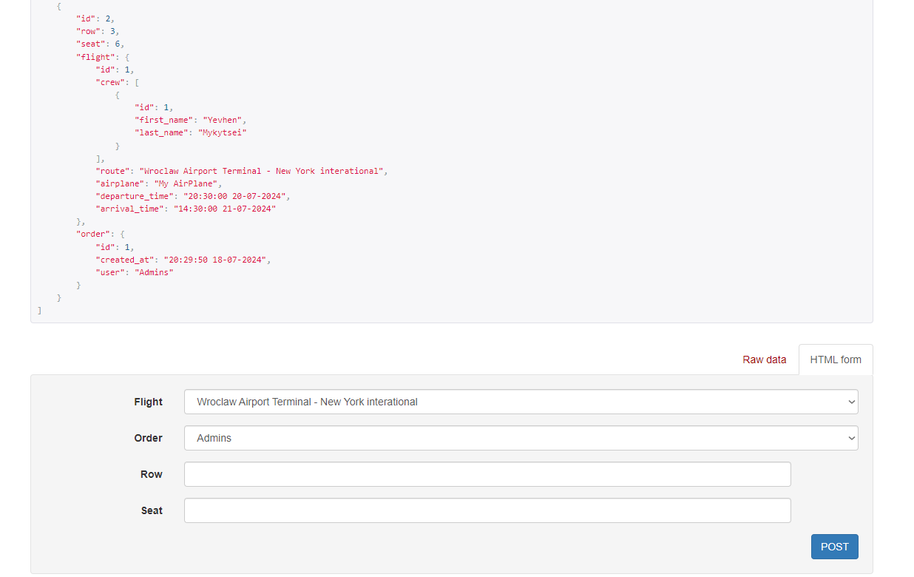
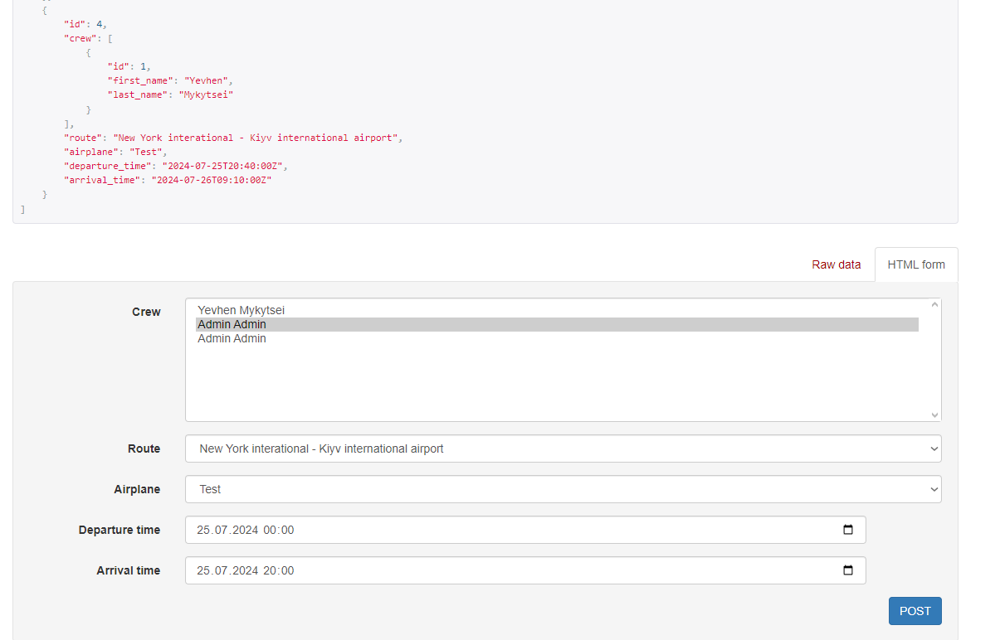
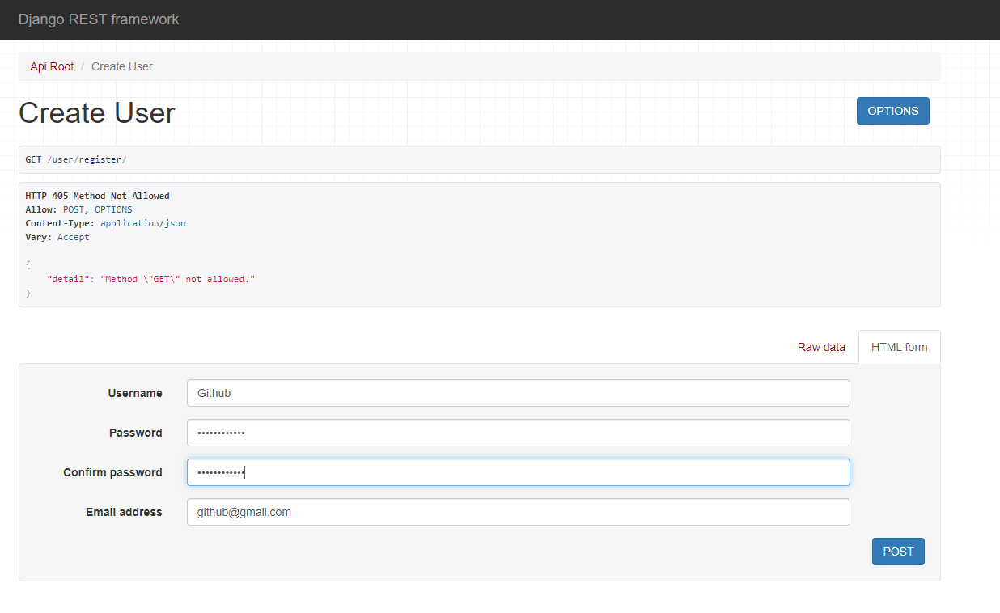

# Py-Airport-API-Service

## Project Description

Py-Airport-API-Service is a RESTful web service for managing airports, flights, tickets, and orders.

### Technology Stack

- Python
- Django
- Django REST framework
- SQLite

### Installation

1. Clone the repository:
    ```sh
    git clone <repository_url>
    ```

2. Navigate to the project directory:
    ```sh
    cd Py-Airport-API-Service
    ```

3. Create and activate a virtual environment:
    ```sh
    python -m venv .venv
    .venv\Scripts\activate  # Windows
    source .venv/bin/activate  # Linux/MacOS
    ```

4. Install dependencies:
    ```sh
    pip install -r requirements.txt
    ```

5. Create a `.env` file in the root directory and add the `SECRET_KEY` variable:
    ```env
    SECRET_KEY=your_secret_key
    ```

6. Apply migrations:
    ```sh
    python manage.py migrate
    ```

7. Run the server:
    ```sh
    python manage.py runserver
    ```

### Testing Instructions

1. Create a test database and run tests:
    ```sh
    python manage.py test
    ```

### Photo Scheme
   
   

### Screenshots API

1. Menu API
   
2. Crew
   
3. Airport
   
4. Airplane
   
5. Airplane Type
   
6. Order
   
7. Ticked
   
8. Flight
   
9. Register
   